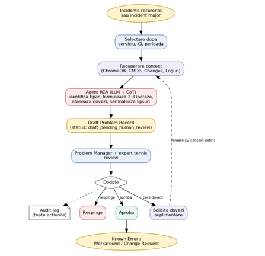

# Proiect Root-Cause Analysis (RCA)

## 1. Problem Definition & Scope

**Business / IT Problem:** În Problem Management (ITIL), un „problem” reprezintă cauza reală sau potențială a unuia sau mai multor incidente. Scopul procesului nu este restaurarea imediată a serviciului (aceasta este responsabilitatea Incident Management), ci prevenirea reapariției incidentelor prin identificarea cauzei rădăcină (Root Cause Analysis — RCA) și implementarea de soluții durabile (Known Error, workaround structurat sau Change Request).
Problema de business/IT abordată de acest proiect este următoarea: în organizațiile cu volum mare de incidente, identificarea manuală a tiparelor recurente și formularea de ipoteze de cauză consumă timp semnificativ din partea Problem Manager-ului și a experților tehnici, iar analiza istoricului de incidente, al configurațiilor (CMDB), al schimbărilor recente (Changes) și al logurilor se face în mod fragmentat, în surse separate, fără o corelare sistematică. Acest lucru duce la întârzieri în deschiderea Problem Record-urilor, la ipoteze incomplete și, uneori, la eșecul de a sesiza corelații evidente (de exemplu, o schimbare recentă de configurare care coincide cu apariția unui tipar de eșec).
**Obiectivul proiectului** este construirea unui agent AI asistiv care, pornind de la unul sau mai multe incidente recurente (sau de la un incident major), recuperează automat contextul relevant din surse multiple, identifică tiparul (pattern) și propune 2–3 ipoteze de cauză rădăcină, fiecare însoțită de dovezi citate explicit și de un pas de validare concret. Rezultatul este un draft de Problem Record, nu un verdict automat — decizia finală rămâne întotdeauna la Problem Manager și la expertul tehnic.

**Oiective:**

- Reducerea timpului necesar pentru formularea unui prim draft de Problem Record, pornind de la incidente deja înregistrate.
- Creșterea calității ipotezelor de cauză prin corelarea sistematică a istoricului de incidente, CMDB, changes recente și loguri.
- Asigurarea trasabilității: fiecare ipoteză trebuie să fie susținută de dovezi citabile (ID-uri de incidente, loguri, changes).
- Menținerea controlului uman asupra deciziilor cu impact (aprobare, respingere, solicitare de dovezi suplimentare), agentul nefiind autorizat să declare o cauză ca fiind confirmată.
- Livrarea unui sistem end-to-end, demonstrabil, cu cost zero de licențiere (LLM open-source local sau prin tier gratuit), potrivit unui proiect de academie.

**Scope:**

- Ingestia și căutarea semantică în istoricul incidentelor și al rezoluțiilor anterioare.
- Corelarea automată a incidentelor cu topologia serviciilor (CMDB), modificările recente (Changes) și mesajele din loguri.
- Formularea a 2–3 ipoteze de cauză rădăcină însoțite de citări exacte și pași practici de validare.
- Asigurarea unui flux Human-in-the-Loop (aprobare, respingere, cerere de investigații suplimentare) cu jurnalizare completă de audit.

**Assumptions:**

- Datele despre incidente conțin descrieri textuale, timestamp-uri și referințe către serviciile afectate.
- Sistemele adiacente (CMDB, Changes, Logs) sunt accesibile prin interfețe de tip mock/API structurat.
- Utilizatorii (Problem Manager, expert tehnic) au cunoștințe de bază despre procesul ITIL de Problem Management.
- Un incident/grup de incidente este deja „selectat” sau selectabil în sistem înainte de a porni analiza (nu face obiectul acestui proiect integrarea cu un sistem de ticketing real pentru colectarea inițială).

**Exclusions:**

- Sistemul nu garantează identificarea corectă a cauzei rădăcină — oferă ipoteze plauzibile, clasificate după puterea dovezilor, nu certitudini.
- Sistemul nu execută remedieri automate în producție (auto-healing/auto-remediation direct).
- Sistemul nu înlocuiește Incident Management-ul (nu face dispecerat de alerte live pentru Service Desk).
- Sistemul nu emite verdicte definitive nesupuse validării umane.
- Nu se implementează notificări automate către Service Owner sau integrare cu sisteme de change management pentru deschiderea automată a unui Change Request — se generează doar recomandarea.


## 2. Understanding of the Process

| Etapa | Metoda Tradiționala | Blocaje & Ineficiențe | Imbunătățirea prin AI
| ---------------- | ------------------------------- | ----------------------------- | -----------------------------------|
| Detectie tipar | Problem Managerul analizează manual rapoarte săptămânale în Excel/Jira pentru a găsi tipare. |  Detectare lentă (zile/săptămâni); corelațiile subtile între servicii diferite sunt omise. | Identificare semantică automată a recurenței pe baza similarității vectoriale și a ferestrelor temporale. |
| Colectare Context | Inginerul deschide manual 3–4 unelte diferite: CMDB, pipeline-ul de CI/CD, dashboard-ul de loguri. | Amestecuri informaționale; timp pierdut comutând între platforme disparate. | Agregare unificată prin Tools: interogare simultană în CMDB, Changes și Loguri pentru CI-ul afectat. |
| Analiză Cauză (RCA) | Brainstorming bazat pe memoria tehnică a echipei sau pe presupuneri nefondate (trial and error). | Cognitive bias; risc mare de eroare umană; dependență critică de disponibilitatea seniorilor. | Raționament Chain-of-Thought (CoT): sinteză logică pas cu pas, formulare de ipoteze cu grad de certitudine și trimiteri directe la dovezi. |
| Documentare | Redactare manuală a Problem Record-ului, adesea incompletă sau fără pași clari de verificare. | Lipsă de standardizare; documentația tehnică devine o sarcină evitată de ingineri. | Generare de draft structurat (JSON/Pydantic) gata de revizuire, cu pași concreți de validare tehnică. | 

## 3. Proposed Solution / TO-BE Flow

Sistemul propus este o aplicație agentică asistivă, cu un flux TO-BE care păstrează structura procesului ITIL de Problem Management, dar automatizează etapa de recuperare a contextului și de formulare a ipotezelor inițiale. Problem Manager rămâne punctul de intrare și de decizie al procesului; agentul AI acționează ca un „asistent de investigație” care pregătește un draft documentat, pe care omul îl validează, îl respinge sau îl trimite spre completare.

| Actor | Rol in flux |
|---------------------| --------------------------------------------------------------------- |
| Problem Manager | Problem Coordinator | Pornește analiza, selectează serviciul/CI/perioada, revizuiește draftul, aprobă Problem Record-ul|
| Incident Manager | Furnizează incidentele și contextul inițial (grupul de incidente recurente sau incidentul major) |
| Developer / DevOps / SRE / Infrastructură | Oferă sau validează dovezile tehnice; primește draftul prin „Trimite către expert tehnic” |
| Service Owner | Poate aproba acțiunile ulterioare (de ex. Change Request rezultat din Known Error) |
| Agent AI (RCA) | Recuperează istoricul și contextul tehnic, propune ipoteze de cauză cu dovezi și pas de validare |



Pașii fluxului:
1.	Punct de plecare: incidente recurente (detectate de Incident Management sau printr-un raport de tendințe) sau un incident major individual.
2.	Problem Manager selectează contextul de analiză: serviciul afectat, CI-ul (Configuration Item) relevant și perioada de timp.
3.	Agentul recuperează automat: istoricul de incidente similare (ChromaDB/RAG), dependențele din CMDB, schimbările recente (Changes) și logurile relevante.
4.	Agentul RCA identifică tiparul (de exemplu, „eșecuri repetate luni între 09:00–10:00”), formulează 2–3 ipoteze de cauză, atașează dovezi și citări pentru fiecare, și indică explicit ce informații lipsesc, dacă e cazul.
5.	Se generează draftul de Problem Record, cu statusul draft_pending_human_review — niciodată o concluzie finală.
6.	Problem Manager revizuiește draftul; poate trimite direct către expertul tehnic pentru validarea dovezilor (butonul „Trimite către expert tehnic”).
7.	Decizia umană: Aprobă (draftul devine Problem Record oficial, cu Known Error / workaround / Change Request asociat), Respinge (se închide draftul, cu motiv înregistrat), sau Solicită dovezi (agentul reia recuperarea cu context extins sau solicită informații suplimentare din partea echipelor tehnice).
8.	Toate acțiunile (selecție, generare draft, trimitere, aprobare, respingere, solicitare de dovezi) sunt înregistrate în jurnalul de audit.

Interfața propusă (simplificată, fără autentificare complexă)
- Ecran principal Problem Manager: selecție serviciu/CI/perioadă, listă de incidente candidate, buton „Pornește analiza”.
- Ecran rezultat/draft: afișarea tiparului identificat, a ipotezelor cu dovezi și evidence strength, a informațiilor lipsă, și butonul „Trimite către expert tehnic”.
- Ecran review (Problem Manager / expert tehnic): butoane „Aprobă”, „Respinge”, „Solicită dovezi”, cu câmp opțional de comentariu.
- Toate acțiunile din ecranele de mai sus sunt persistate în audit log (actor simulat prin selecție de rol, fără sistem complet de autentificare).
 
## Arhitectură la nivel înalt (High-Level Architecture)


| Componenta | Rol | Tehnologie propusa |
| -------------------- | --------------------------------------------------- | -------------------------------- | 
| UI | Ecran Problem Manager + ecran de review (selecție, vizualizare draft, aprobare/respingere/solicitare dovezi) | Streamlit |
| Backend / API | Orchestrare cereri, validare schemă, expunere endpoints, scriere audit log | FastAPI (Docker) |
| Model / LLM | Raționament Chain-of-Thought: identifică tipar, formulează ipoteze, decide ce tool-uri să apeleze | LLM open-source via Ollama (local) sau Groq (tier gratuit) |
| Retrieval (RAG) | Recuperare semantică a incidentelor istorice similare | ChromaDB (vector store) + embeddings |
| Data (mock tools) | CMDB, Changes, Loguri — surse structurate simulate, interogabile prin funcții deterministe | Tool layer (funcții Python peste date mock JSON/SQLite) |
| Aplicație / Validare | Validarea structurii ieșirii LLM înainte de a fi expusă ca draft | Pydantic schema pentru Problem Record |
| Output | Draft de Problem Record +, după aprobare, Known Error / Workaround / Change Request | JSON structurat, persistat |
| Observability | Trasabilitatea deciziilor agentului, pentru debugging și verificare | Arize Phoenix / traces |
| Audit | Jurnal al tuturor acțiunilor umane și ale agentului | Log persistat (bază de date sau fișier structurat) |

Un principiu central al arhitecturii este separarea clară între raționamentul LLM (care propune, interpretează, formulează ipoteze în limbaj natural, validat apoi printr-o schemă Pydantic) și execuția tool-urilor (funcții deterministe care interoghează ChromaDB, CMDB, Changes și Loguri, și returnează date structurate, nu text liber). Această separare reduce riscul de „halucinație” a datelor factuale — LLM-ul nu inventează un ID de incident sau un CI, ci doar interpretează rezultatele returnate de tool-uri, care sunt verificabile și reproductibile.

## Proiectarea datelor și abordarea RAG (Data Design & RAG Thinking)

### Date necesare

- Istoric de incidente: descriere, serviciu afectat, CI, timestamp deschidere/închidere, severitate, note de rezolvare, tag-uri.
- CMDB (mock): servicii, Configuration Items (CI), relații de dependență între CI-uri (de ex. Payroll API depinde de PayrollDB).
- Changes recente (mock): CR-uri cu descriere, CI afectat, data aplicării, autor, tip (config change, deployment, etc.).
- Loguri relevante (mock): mesaje de eroare/evenimente asociate unui serviciu/CI, cu timestamp și severitate (de ex. „database connection pool exhausted”).

### Entități și schemă aproximativă

| Entitati | Campuri principale |
| ------------------- | -------------------------------------------------------------------------|
| Incident | incident_id, title, description, affected_service, ci_id, opened_at, closed_at, severity, resolution_notes, tags |
| CI (CMDB) | ci_id, name, type (service/app/db/infra), depends_on[] (listă de ci_id) |
| Change | change_id, ci_id, description, applied_at, author, type |
| Log entry | log_id, ci_id/service, timestamp, level, message |
| Problem Record (draft) | title, affected_service, linked_incidents[], pattern, hypotheses[], recommended_workaround, change_required, status |
| Hypothesis | cause, evidence[], evidence_strength (low/medium/high), validation_step |
| Audit entry | actor, action, target (ex. problem_record_id), timestamp, comment |

### Strategia de date mock

Se va construi un set de date mock realist, de aproximativ 200–500 de incidente, distribuite pe câteva servicii (de ex. Payroll API, Billing Service, Auth Gateway), cu 2–3 tipare recurente construite intenționat (de exemplu, eșecuri de tip „connection pool exhausted” corelate cu o schimbare de configurare recentă, sau eșecuri de memorie corelate cu un deployment recent), astfel încât agentul să poată demonstra identificarea corectă a corelației cauză–efect în scenarii cunoscute, verificabile de către evaluator. Datele CMDB, Changes și Loguri vor fi generate coerent cu incidentele (aceleași ci_id, aceleași ferestre de timp), pentru ca RCA-ul să fie plauzibil și verificabil.

### Ce informație necesită retrieval/search

Istoricul de incidente este singura sursă pentru care este justificată căutarea semantică (RAG): descrierile incidentelor sunt text liber, iar incidente similare pot folosi formulări diferite pentru aceeași cauză (de exemplu, „aplicația nu răspunde” vs. „timeout la request”). CMDB, Changes și Loguri, fiind date structurate, sunt interogate direct (filtrare pe ci_id / interval de timp), fără a necesita căutare semantică — acestea sunt tratate ca tool-uri deterministe, nu ca surse RAG.

### Utilizarea ChromaDB

- Fiecare incident istoric este indexat ca un document (titlu + descriere + note de rezolvare), cu embedding generat printr-un model de embeddings open-source
- Metadate atașate fiecărui document: ci_id, affected_service, opened_at, incident_id — pentru a permite filtrare combinată (similaritate semantică + filtre structurate pe serviciu/perioadă).
- La interogare, agentul caută top-k incidente similare cu incidentul/grupul curent, restrânse la serviciul și fereastra de timp selectate de Problem Manager.
- Rezultatele RAG sunt folosite ca dovezi citabile (linked_incidents), nu doar ca context implicit — fiecare incident_id returnat de ChromaDB poate apărea explicit în lista de evidence a unei ipoteze.
- Calitatea retrieval-ului va fi evaluată cu RAGAS (relevanță, fidelitate față de sursă), conform cerințelor proiectului.

## Concept de raționament, decizie și execuție

| Agent | Responsabilitate |
| -------------------------- | ---------------------------------------------------------------------------------|
| Agent de recuperare context (retrieval) | Decide ce interogări sunt necesare (RAG pe ChromaDB, interogări CMDB/Changes/Loguri) în funcție de serviciul, CI-ul și perioada selectate |
| Agent RCA (Chain-of-Thought) | Analizează contextul recuperat, identifică tiparul, formulează 2–3 ipoteze de cauză, evaluează puterea dovezilor și propune pași de validare |
| Componentă de validare a ieșirii | Verifică (schema Pydantic) că structura Problem Record-ului generat de LLM este completă și corectă înainte de a fi expusă ca draft |
| Om în buclă (Problem Manager / expert tehnic) | Validează, aprobă, respinge sau solicită dovezi suplimentare — punctul final de decizie |

### Principii de decizie și execuție

- Raționamentul (Chain-of-Thought) este expus explicit sub formă de ipoteze cu dovezi și grad de încredere (evidence_strength), nu ca o singură concluzie fără justificare.
- Execuția este strict limitată la recuperare de date și generare de draft — agentul nu execută acțiuni corective (nu modifică configurări, nu deschide automat Change Request-uri).
- Orice acțiune cu efect asupra stării Problem Record-ului (trimitere spre expert, aprobare, respingere) necesită decizie umană explicită, înregistrată în audit.
- Lipsa informației este tratată ca rezultat valid și util (agentul semnalează explicit ce date lipsesc), nu ca eșec al analizei

## KPI și criterii de succes

**KPI 1 — Timp până la un prim draft de Problem Record**

Măsoară timpul scurs din momentul selectării incidentelor/serviciului de către Problem Manager până la generarea draftului de Problem Record de către agent, comparat cu timpul mediu istoric necesar pentru un prim draft realizat manual (estimat retrospectiv, pe baza timestamp-urilor de deschidere a Problem Record-urilor anterioare din procesul actual, dacă sunt disponibile, sau printr-un studiu de referință simplu în care aceeași investigație este parcursă manual de un evaluator, cronometrat, pentru comparație).

**KPI 2 — Rata de acceptare a ipotezelor propuse de agent**

Măsoară procentul de Problem Record-uri în care cel puțin o ipoteză propusă de agent este aprobată (integral sau parțial, eventual după solicitare de dovezi suplimentare) de către Problem Manager/expert tehnic, din totalul draft-urilor generate. Această metrică se calculează direct din fluxul „Aprobă / Respinge / Solicită dovezi”, deja înregistrat în audit log, fără a necesita instrumentare suplimentară: rata de acceptare = (draft-uri aprobate) / (total draft-uri generate).

### Metodologia de verificare

- Cele două KPI de mai sus se pot calcula direct din datele deja capturate de sistem: audit log-ul (timestamp-uri pentru fiecare etapă a fluxului) și starea finală a fiecărui Problem Record (status: aprobat / respins / dovezi solicitate).
- Pentru comparația cu procesul manual, se poate folosi fie un baseline istoric (dacă există date despre durata investigațiilor anterioare), fie un mic experiment controlat: aceleași 3–5 cazuri de test rulate atât prin agent, cât și manual de un evaluator, comparând timpul și numărul de surse consultate.
- Nu se estimează valori numerice în această etapă a documentației — se stabilește doar modul în care succesul va fi verificat ulterior, pe baza datelor generate de sistem în timpul demo-ului.

## Anexă — Exemplu ilustrativ de draft Problem Record

Exemplul de mai jos ilustrează formatul JSON al draftului generat de agent, pentru scenariul „Payroll API devine indisponibilă luni între 09:00–10:00”, cu 14 incidente similare identificate într-o lună:

```json
{   
    "title": "Recurring Payroll API availability failures",   
    "affected_service": "Payroll API",   
    "linked_incidents": ["INC-101", "INC-117", "INC-124"],   
    "pattern": "Failures occur during Monday payroll batch",   
    "hypotheses": [     
        {       
            "cause": "Database connection pool exhaustion",       
            "evidence": ["INC-117 resolution notes", "LOG-2026-041", "CHG-044"],       
            "evidence_strength": "high",       
            "validation_step": "Run load test with previous pool configuration"     
        }   
    ],   
    "recommended_workaround": "Temporarily increase connection pool",   
    "change_required": true,   
    "status": "draft_pending_human_review" 
}
```

Se observă că agentul nu afirmă „aceasta este cauza” — propune ipoteza, gradul de încredere susținut de dovezi și un pas de validare concret prin care ipoteza poate fi confirmată sau infirmată de expertul tehnic.