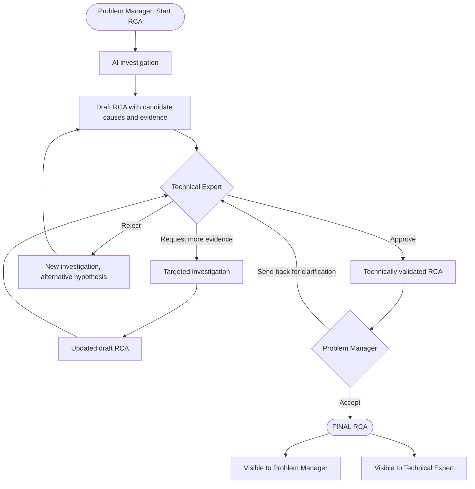

# 3. Proposed Solution and TO-BE Flow

**Project:** AI-assisted Root Cause Analysis (RCA) application
**Area:** Problem Management, large company
**Last updated:** 2026-08-19

---

## 3.1 The idea in short

The Problem Manager opens an incident that needs an RCA and presses one button. The
application then does automatically what an expert used to do by hand: it finds the
similar incidents, reads the past RCAs, checks the service dependencies, collects the
recent changes and the logs from the incident window, and puts everything on one timeline.

Out of this it writes a **draft RCA**: one or more candidate root causes, each with the
evidence that supports it and a link to where that evidence came from.

The draft then goes to a Technical Expert, who approves it, rejects it, or asks for more
evidence. Only after a human approves does the RCA become final.

The change compared to today is simple: **the expert starts from a prepared case instead
of an empty page.**

---

## 3.2 The TO-BE flow, step by step

| Step | What happens | Who |
|---|---|---|
| 1 | Opens the list of incidents that need an RCA and starts one | Problem Manager |
| 2 | Groups the current incident with the similar past incidents, so the recurring problem is visible | Application |
| 3 | Plans the investigation: which service, which time window, which sources to check | Application |
| 4 | Searches the past incidents and past RCAs by meaning, not by keyword | Application |
| 5 | Collects the service dependencies, the recent changes and the logs from the time window | Application |
| 6 | Stores every fact found as a separate piece of evidence, with its source | Application |
| 7 | Builds the timeline and writes the candidate root causes, with confidence and evidence | Application |
| 8 | Writes down what could not be checked | Application |
| 9 | Reviews the draft and sends it to the Technical Expert | Problem Manager |
| 10 | Reads the hypotheses and the evidence, then approves, rejects, or asks for more evidence | Technical Expert |
| 11 | If more evidence is asked: runs a second, narrow investigation and updates the draft | Application |
| 12 | Accepts the validated RCA, or sends it back for clarification | Problem Manager |
| 13 | Saves the final RCA and shows it to both roles | Application |

Steps 2 to 8 are the part that used to take days. They now run in one go, without a
person in between.

Step 3 has a manual override. By default the application decides the service and the time
window by itself. Before starting, the Problem Manager can set them by hand, for example
to look at one component only, or at a longer period. The plan is then built inside those
limits. The default keeps the flow automatic; the override exists for the cases where the
person knows something the data does not show.

---

## 3.3 User flow diagram



Both roles see the same final RCA, because the result belongs to both of them. The
application does the investigation, the Technical Expert validates the technical part, and
the Problem Manager owns the process and the result.

---

## 3.4 What each role sees

**Problem Manager**

- A list of incidents that need an RCA, and a button to start one.
- An optional filter to set the service and the time window by hand before starting.
- The investigation while it runs: which source is being checked, what was found.
- The draft RCA: candidate causes, evidence, what could not be checked.
- A button to send the draft to the Technical Expert.
- The final RCA, with a button to accept it or send it back.

**Technical Expert**

- A list of drafts waiting for review.
- The full draft: hypotheses ordered by confidence, the evidence behind each one, and the
  reason why the confidence is high or low.
- The original evidence, so a statement can be checked without leaving the application.
- Three buttons: approve, reject, request more evidence. Each one asks for a short comment.
- The final RCA.

**Both**

One single official RCA page, showing the status, the root cause, the evidence, the
technical validation, the RCA owner, the creation date and the completion date.

---

## 3.5 The states of an RCA

| State | Meaning | Who acts next |
|---|---|---|
| Investigating | The application is collecting evidence and writing the draft | Nobody, it is running |
| Pending review | The draft was sent to the expert | Technical Expert |
| More evidence required | The expert asked for something specific | Application, then the expert again |
| Rejected | The expert refused the hypotheses | Application, with a new investigation |
| Technically validated | The expert approved the technical part | Problem Manager |
| Final | The Problem Manager accepted it | Nobody, the RCA is closed |
| Escalated | Two rounds of extra evidence were not enough | A human investigation outside the application |

The RCA can only reach the state **Final** by passing through a human approval. There is
no path where the application closes an RCA by itself.

---

## 3.6 The human decision points

There are two, and they are different on purpose.

**The Technical Expert approves the content.** This is the mandatory control point. The
expert answers the question: *is this hypothesis technically correct, and does the evidence
really support it?* Nothing can move forward without this answer.

The three possible answers:

- **Approve** — the hypothesis becomes the technically validated root cause.
- **Reject** — the application starts again and looks for a different explanation. The
  reason given by the expert is used in the new investigation.
- **Request more evidence** — the expert says exactly what is missing. The application
  runs a narrow, targeted investigation and comes back with an updated draft. This is
  allowed twice. After the second time the case is escalated to a manual investigation,
  so the loop cannot continue forever.

**The Problem Manager accepts the process.** This is the business control point. The
Problem Manager answers a different question: *is this RCA complete and clear enough to
close?* If not, it goes back to the expert for clarification.

---

## 3.7 How this solves the problems from document 2

| Bottleneck today | How the solution removes it |
|---|---|
| Information spread across many systems | One investigation queries all sources in one run |
| Old RCAs are found by keyword, or not at all | Search by meaning, so different wording still matches |
| Waiting for other teams | The data is collected directly, without asking a person |
| Manual correlation of the timeline | The timeline is built automatically from the collected evidence |
| Expert time used for searching | The expert receives a prepared case and only reviews it |
| The first plausible cause wins | At least two hypotheses are always proposed |
| The result depends on the person | Every RCA has the same structure and the same steps |
| Evidence is not traceable | Every statement points to the record it came from |
| Recurrence is noticed too late | The investigation starts by grouping the similar incidents |

---

## 3.8 What goes in and what comes out

**In.** One incident that needs an RCA. It carries symptoms and context only, never the
answer.

```json
{
  "incident_id": "INC-2026-00482",
  "title": "Payment API intermittent failures",
  "severity": "SEV-1",
  "service": "Payment API",
  "environment": "production",
  "detected_at": "2026-07-14T14:32:00Z",
  "resolved_at": "2026-07-14T15:17:00Z",
  "symptoms": [
    "HTTP 500 responses from Payment API",
    "increased database connection timeout errors",
    "latency above 5 seconds"
  ],
  "impact": { "failed_transactions": 18420, "error_rate_peak": "18.7%" },
  "rca_required": true
}
```

**Out.** The draft RCA that the Technical Expert receives. Shortened here to one
hypothesis and two pieces of evidence. The full shape is in document 6.

```json
{
  "rca_id": "RCA-2026-00137",
  "incident_id": "INC-2026-00482",
  "status": "PENDING_TECHNICAL_REVIEW",
  "linked_incidents": ["INC-2026-00311", "INC-2026-00402"],
  "observed_pattern": "Failures appear within one hour of a production deployment of the Payment API.",
  "hypotheses": [
    {
      "hypothesis_id": "HYP-001",
      "candidate_root_cause": "Connection pool exhaustion introduced by Payment API v4.18.2.",
      "confidence": "HIGH",
      "supporting_evidence": ["EV-001", "EV-002"],
      "contradicting_evidence": [],
      "recommended_validation": ["Compare connection usage before and after v4.18.2."]
    }
  ],
  "evidence": [
    { "evidence_id": "EV-001", "type": "LOG", "citation": "LOG-2026-00482-14" },
    { "evidence_id": "EV-002", "type": "CHANGE", "citation": "CHG-2026-00871" }
  ],
  "not_checked": ["No database metrics were available for the incident window."],
  "suggested_workaround": "Temporarily raise the connection pool limit.",
  "change_likely_required": true,
  "final_root_cause": null
}
```

Four things in this output are the whole design, on one screen:

- it says **candidate root cause**, never root cause,
- `final_root_cause` stays `null` until a Technical Expert approves,
- every hypothesis cites evidence identifiers, and every identifier exists in the evidence
  list under it, so no statement can point at a source that was never found,
- what could not be checked is written down instead of left out.
