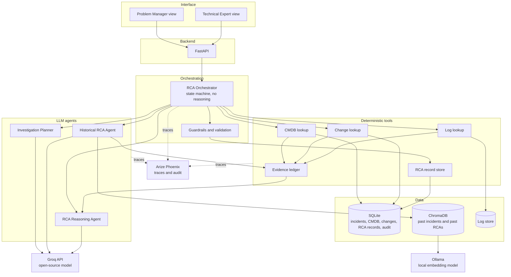
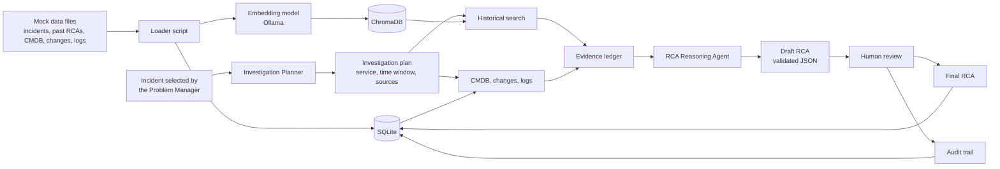
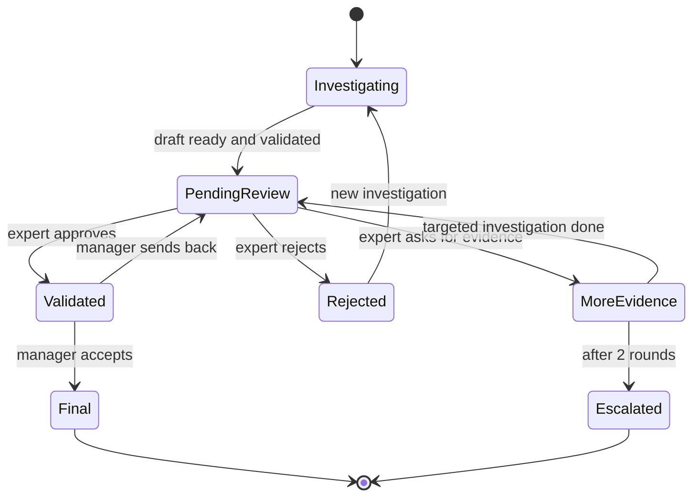

# 4. High-Level Architecture

**Project:** AI-assisted Root Cause Analysis (RCA) application
**Area:** Problem Management, large company
**Last updated:** 2026-08-18

---

## 4.1 Overview

The application is built in five layers. Each layer has one job and talks only to the
layer next to it.

| Layer | Job |
|---|---|
| Interface | What the two users see and click |
| API | Receives the requests and returns the answers |
| Orchestration | Runs the investigation step by step and knows the state of each RCA |
| Reasoning and tools | Three LLM agents that think, and deterministic tools that fetch data |
| Data | The mock source systems, the vector database and the RCA records |

Two rules hold the design together:

- **Only the three LLM agents produce text.** Everything else is normal code with a
  predictable result.
- **Nothing is written as final without a human approval.**

---

## 4.2 Architecture diagram

The dotted lines are observability. Every step reports what it did to Phoenix, without
changing the flow.

---

## 4.3 Components

### Interface

| Component | Responsibility | Technology |
|---|---|---|
| Problem Manager view | Incident list, start RCA, follow the investigation, send to review, accept the final RCA | Streamlit |
| Technical Expert view | Review queue, read the draft and the evidence, approve, reject, request more evidence | Streamlit |

There is no login system. The user picks a role when opening the application, and the
chosen role is recorded with every action.

### Backend

| Component | Responsibility | Technology |
|---|---|---|
| API | Receives the requests from the interface, starts investigations, returns RCA data, records human decisions | FastAPI |

The interface never talks to the database or to the model directly. Everything passes
through the API.

### Orchestration

| Component | Responsibility | Technology |
|---|---|---|
| RCA Orchestrator | Decides which step runs next, keeps the state of each RCA, stops and waits for the human, resumes afterwards | LangGraph |
| Guardrails and validation | Checks the model output against the schema, checks the citations, calculates the confidence, decides if the human approval is needed | Pydantic and plain Python |

The orchestrator does not reason. It only routes.

### LLM agents

| Agent | What it does | Uses |
|---|---|---|
| Investigation Planner | Reads the incident and decides what to look for: which service, which time window, which sources | Groq |
| Historical RCA Agent | Writes the search queries, retrieves similar incidents and past RCAs, judges whether they are really similar | Groq and ChromaDB |
| RCA Reasoning Agent | Correlates all the evidence and writes the candidate root causes | Groq |

### Deterministic tools

| Tool | What it does |
|---|---|
| CMDB lookup | Returns the components a service depends on |
| Change lookup | Returns the changes and deployments inside a time window |
| Log lookup | Returns the log lines for a service inside a time window |
| Evidence ledger | Stores every fact found, with an id, a type, a source and a timestamp |
| RCA record store | Saves and reads the RCA record, the decisions and the audit entries |

None of these calls a model. Each one can be tested with normal unit tests.

### External services

| Service | Role | Where it runs |
|---|---|---|
| Groq | The reasoning model, open-source, free tier | Cloud |
| Ollama | The embedding model for the vector search | Local machine |
| Arize Phoenix | Traces, decisions and audit | Local container |

---

## 4.4 Data workflow

This is how data moves through the system, from the mock files to the final RCA.

Step by step:

1. **Preparation, done once.** A loader script reads the mock files. The structured data
   goes into SQLite. The text of past incidents and past RCAs is turned into vectors by
   the local embedding model and stored in ChromaDB, together with its identifier.
2. **Start.** The Problem Manager selects an incident. The API creates an RCA record and
   starts the orchestrator.
3. **Plan.** The Investigation Planner reads the incident and produces the plan: the
   service, the time window to search, and which sources are relevant.
4. **Collect.** The historical search runs against ChromaDB. The deterministic tools read
   the CMDB, the changes and the logs from SQLite and the log store.
5. **Store the evidence.** Every result becomes an evidence record with an identifier, a
   type, a source and a timestamp. Nothing goes further without being recorded here.
6. **Reason.** The RCA Reasoning Agent receives only the evidence ledger and writes the
   candidate root causes, citing evidence identifiers.
7. **Validate.** The output is checked against the schema, the citations are checked
   against the ledger, and the confidence is calculated.
8. **Human review.** The draft is saved and the flow stops until a person decides.
9. **Finish.** After the approvals, the final RCA is saved. Every decision is written to
   the audit trail.

The important part is step 5. Because every fact becomes a numbered evidence record before
the reasoning starts, the model can only build on things that really exist, and every
sentence in the final RCA can be traced back to its source.

---

## 4.5 Orchestration and states

### Why LangGraph

The investigation must stop in the middle, wait for a human who may answer hours later,
and then continue from the same point. LangGraph does this with a built-in pause and a
saved state, so we do not have to build it ourselves. It also gives us the state, the
routing and the retry loops as normal graph nodes, which is exactly what the architecture
needs, and it is easy to trace in Phoenix.

A custom orchestrator would mean writing the same pause, save and resume logic by hand,
with more code and more risk, and without any benefit for this project.

### The state of an RCA

The state is saved after every step. If the application is restarted, an RCA continues
from where it stopped.

---

## 4.6 Handoffs

A handoff is the moment when one part gives work to another, and what it passes along.

| From | To | What is passed |
|---|---|---|
| API | Orchestrator | The incident and the id of the new RCA |
| Orchestrator | Investigation Planner | The incident and the similar incidents found so far |
| Investigation Planner | Orchestrator | The investigation plan, as validated JSON |
| Orchestrator | Historical RCA Agent | The plan and the search queries |
| Orchestrator | CMDB, change and log tools | The service name and the time window from the plan |
| All agents and tools | Evidence ledger | One evidence record per fact found |
| Evidence ledger | RCA Reasoning Agent | The complete list of evidence |
| RCA Reasoning Agent | Guardrails | The draft RCA, as JSON |
| Guardrails | Orchestrator | Accepted draft, or an error that sends the agent back to try again |
| Orchestrator | Interface | The draft RCA, and the flow pauses |
| Interface | Orchestrator | The human decision and the comment |
| Orchestrator | RCA record store | The final RCA and the audit entries |

Two handoffs deserve attention:

- **Evidence ledger to Reasoning Agent.** The reasoning agent receives the ledger and
  nothing else. It cannot invent a source, because it never sees the raw systems.
- **Guardrails to Orchestrator.** If the JSON does not match the schema, or a citation
  points to an evidence id that does not exist, the draft is refused and the agent is
  asked again, with the error included. After three failed attempts the RCA is escalated.

---

## 4.7 Observability and audit

Arize Phoenix, connected through OpenTelemetry, records the whole investigation. For
every RCA we can open one trace and see:

- which steps ran, in which order, and how long each one took,
- what was sent to the model and what came back,
- what the retrieval returned and which documents were used,
- which tools were called, with which parameters and which result,
- the validation results and the calculated confidence,
- the human decision: who, when, what they chose and the comment they wrote.

The audit trail in the database keeps the same information in a permanent form, so an RCA
can be explained months later, after Phoenix has been restarted.

This is what makes the difference between a demo and an application that a company could
actually use: for every conclusion we can answer who decided it, on what basis, who
approved it and what was executed.

---

## 4.8 Delivery and deployment

The application is delivered with Docker Compose, with three containers:

| Container | Content | Port |
|---|---|---|
| rca-api | FastAPI, the orchestrator, the agents, the tools, ChromaDB embedded | 8000 |
| rca-ui | Streamlit interface | 8501 |
| phoenix | Arize Phoenix | 6006 |

Two folders are kept outside the containers, so the data survives a restart: the SQLite
database and the ChromaDB files.

The embedding model runs in Ollama on the host machine, and the containers reach it
through the host address. The reasoning model is called over the internet, on the Groq
free tier, with the key given as an environment variable.

Starting the whole application is one command, which is also how the demo will be run.
