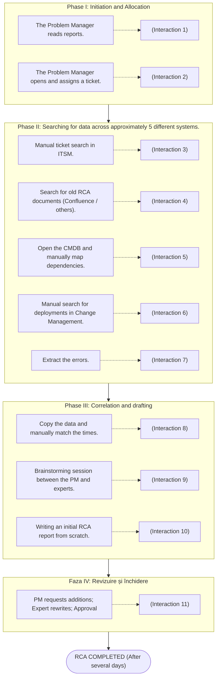

# KPI 1: Reducing human intervention

## Human interaction



## Multi-agent application-assisted process


## Calculation of process efficiency improvement percentage

### Approach I: Analysis of step weighting

| Sistem metric | Manual | Automated (Agentic) |
| :--- | :---: | :---: |
| **Number of human steps** | 11 | 3 |
| **Percentage / step** | 9,09% / step | 33,33% / step |

* $3 \times 9{,}09\% = 27{,}27\%$ $\rightarrow$ If the number of automated steps were compared to the percentage of a manual step.
* $100\% - 27{,}27\% = \mathbf{72{,}73\%}$ $\rightarrow$ **That is how much the process has been streamlined.**

---

### Approach II: Referencing the manual resolution base

* **$I_{\text{manual}} = 11$** (human interactions in RCA solving)
* **$I_{\text{agentic}} = 3$** (human interactions in app-assisted RCA claims resolution)
* **Diferență pași:** 
  $$I_{\text{manual}} - I_{\text{agentic}} = 11 - 3 = 8 \text{ saved interactions}$$

#### Efficiency calculation:

$$\text{Efficiency} = \frac{I_{\text{manual}} - I_{\text{agentic}}}{I_{\text{manual}}} = \frac{8}{11} \approx 0{,}727272\dots$$

In percentages:
$$0{,}727272\dots \times 100 \approx \mathbf{72{,}73\%}$$

> **RCA Process Efficiency Rate:** **`72,73%`** (reduction of human effort/interaction).


# KPI 2: Self-resolution rate


It measures the software architecture's ability to complete an end-to-end technical workflow—from receiving the problem to fully delivering the analysis—100% autonomously, without human assistance or manual intervention to unblock the process during execution.

### 1. In the traditional process
* **Self-resolution rate = 0%** (no stage can be completed using only one's own resources).
* Ticketing systems, configuration management databases (CMDBs), logs, and deployment (change) processes operate in isolation without communicating with one another; consequently, no correlation is triggered when Root Cause Analysis (RCA) begins, as human interaction is required at each stage.

### 2. App-assisted process
* The user initiates the process by selecting an incident and receives the completed analysis at the end.

---

## Comparison by Execution Stages

| # | Stage| Manual | Automated (Agentic) |
| :-: | :--- | :--- | :--- |
| **1.** | **Case initiation** | The man is looking for a ticket. | The person selects the incident. |
| **2.** | **Identification of similar cases** | The man is manually searching through old tickets. | The system searches the CMDB for past incidents. |
| **3.** | **Investigation planning** | The person (TE) reads and manually selects the period. | Planning agent determines (calculates) the period. |
| **4.** | **Evidence collection – 4 sources** | The man opens the manual. | The System |
| **5.** | **Causal correlation & hypotheses** | The Man| The System |
| **6.** | **Evidence validation & structuring** | The Man | The System |
| **7.** | **Technical approval** | The Man| The Man |
| **8.** | **Process termination** | The Man| The Man |

---

## Comparative Calculation

### The Manual Case:
* $E_{\text{autonomy}} = 0$ *(man intervenes in everything)*
* $N_{\text{steps}} = 8$
* $$\text{Auto-Resolution Rate}_{\text{Manual}} = \frac{0}{8} \times 100 = \mathbf{0\%}$$

### Application Use Case (Agentic)
* $E_{\text{autonomy}} = 5$ *(stages 2, 3, 4, 5, and 6 are executed without human intervention)*
* $N_{\text{steps}} = 8$
* $$\text{Auto-Resolution Rate} = \frac{5}{8} \times 100 = \mathbf{62{,}5\%}$$

> **Conclusion:** After automating the process, the self-resolution rate increases from **`0%`** to **`62,5%`**.
```