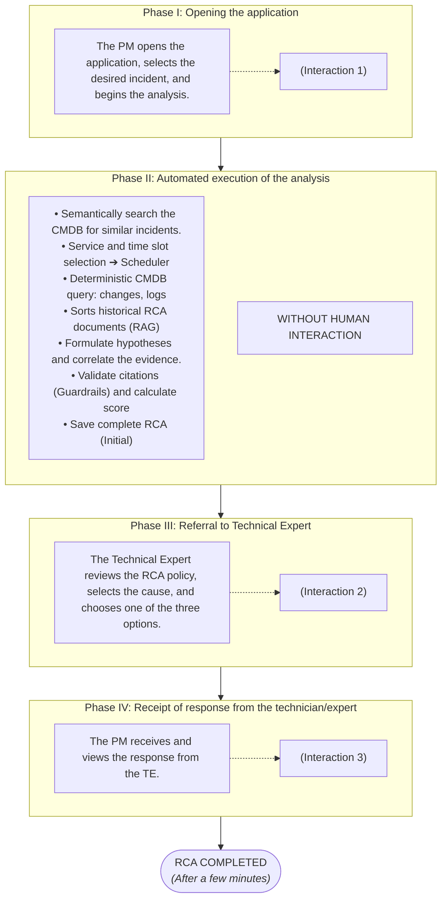

# KPI 1: Reducing human intervention

## Human interaction

## Multi-agent application-assisted process

## Calculation of process efficiency improvement percentage

### Approach I: Analysis of step weighting

| Sistem metric | Manual | Automated (Agentic) |
| :--- | :---: | :---: |
| **Number of human steps** | 11 | 3 |
| **Percentage / step** | 9,09% / step | 33,33% / step |

* $3 \times 9{,}09\% = 27{,}27\%$ $\rightarrow$ If the number of automated steps were compared to the percentage of a manual step.
* $100\% - 27{,}27\% = \mathbf{72{,}73\%}$ $\rightarrow$ **That is how much the process has been streamlined.**

---

### Approach II: Referencing the manual resolution base

* **$I_{\text{manual}} = 11$** (human interactions in RCA solving)
* **$I_{\text{agentic}} = 3$** (human interactions in app-assisted RCA claims resolution)
* **Diferență pași:** 
  $$I_{\text{manual}} - I_{\text{agentic}} = 11 - 3 = 8 \text{ saved interactions}$$

#### Efficiency calculation:

$$\text{Efficiency} = \frac{I_{\text{manual}} - I_{\text{agentic}}}{I_{\text{manual}}} = \frac{8}{11} \approx 0{,}727272\dots$$

In percentages:
$$0{,}727272\dots \times 100 \approx \mathbf{72{,}73\%}$$

> **RCA Process Efficiency Rate:** **`72,73%`** (reduction of human effort/interaction).

# KPI 2: Self-resolution rate

It measures the software architecture's ability to complete an end-to-end technical workflow—from receiving the problem to fully delivering the analysis—100% autonomously, without human assistance or manual intervention to unblock the process during execution.

### 1. In the traditional process
* **Self-resolution rate = 0%** (no stage can be completed using only one's own resources).
* Ticketing systems, configuration management databases (CMDBs), logs, and deployment (change) processes operate in isolation without communicating with one another; consequently, no correlation is triggered when Root Cause Analysis (RCA) begins, as human interaction is required at each stage.

### 2. App-assisted process
* The user initiates the process by selecting an incident and receives the completed analysis at the end.

---

## Comparison by Execution Stages

| # | Stage| Manual | Automated (Agentic) |
| :-: | :--- | :--- | :--- |
| **1.** | **Case initiation** | The man is looking for a ticket. | The person selects the incident. |
| **2.** | **Identification of similar cases** | The man is manually searching through old tickets. | The system searches the CMDB for past incidents. |
| **3.** | **Investigation planning** | The person (TE) reads and manually selects the period. | Planning agent determines (calculates) the period. |
| **4.** | **Evidence collection – 4 sources** | The man opens the manual. | The System |
| **5.** | **Causal correlation & hypotheses** | The Man| The System |
| **6.** | **Evidence validation & structuring** | The Man | The System |
| **7.** | **Technical approval** | The Man| The Man |
| **8.** | **Process termination** | The Man| The Man |

---

## Comparative Calculation

### The Manual Case:
* $E_{\text{autonomy}} = 0$ *(man intervenes in everything)*
* $N_{\text{steps}} = 8$
* $$\text{Auto-Resolution Rate}_{\text{Manual}} = \frac{0}{8} \times 100 = \mathbf{0\%}$$

### Application Use Case (Agentic)
* $E_{\text{autonomy}} = 5$ *(stages 2, 3, 4, 5, and 6 are executed without human intervention)*
* $N_{\text{steps}} = 8$
* $$\text{Auto-Resolution Rate} = \frac{5}{8} \times 100 = \mathbf{62{,}5\%}$$

> **Conclusion:** After automating the process, the self-resolution rate increases from **`0%`** to **`62,5%`**.

# KPI 3: AI Hypothesis Accuracy (Top-1 and Top-K Accuracy)

## 1. What does this KPI measure?
This metric assesses the multi-agent system's ability to identify the true root cause of an incident and rank it prominently in the candidate list submitted to the Technical Expert.

For the human expert reviewing the report, the practical utility of the AI assistant comes down to one decisive question: **"Is the correct root cause present in the proposed hypothesis list?"**:
- If **YES**, the expert reviews the cited evidence and validates the finding with a single click.
- If **NO**, the automated analysis was unhelpful, the expert's time was wasted, and a manual investigation must be started from scratch.

---

## 2. Calculation Formulas

By design, the system produces at least 2 candidate hypotheses per incident to explore alternative scenarios and mitigate premature closure bias. Because an incident typically has a single primary root cause (Ground Truth)[cite: 1], performance cannot be evaluated using a naive metric like "correct hypotheses divided by total hypotheses generated" (which would be artificially capped at ~33–50%).

Instead, two standard ranking and retrieval metrics are evaluated across the total number of investigated incidents:

$$\text{Top-1 Accuracy} = \frac{\text{Number of incidents where Hypothesis \#1 is correct}}{\text{Total investigated incidents}} \times 100$$

- **Top-1 Accuracy:** Quantifies how frequently the highest-ranked candidate (the one with the highest confidence level / points) corresponds directly to the true root cause.

$$\text{Top-K Accuracy} = \frac{\text{Number of incidents where the true cause is in the candidate list}}{\text{Total investigated incidents}} \times 100$$

- **Top-K Accuracy:** Quantifies the overall success rate of the pipeline, verifying whether the correct explanation appears anywhere in the generated list (Hypothesis 1, 2, or 3).

*Representative Example:* Across a suite of 13 investigated incidents, if the top hypothesis is correct in 9 cases, and the true cause appears somewhere in the proposed list in 12 cases, the results are:
- **Top-1 Accuracy = 69.2%**
- **Top-K Accuracy = 92.3%**

---

## 3. Technical Decision Rule (Correctness Criterion)

Because the reference cause (`true_root_cause`) in the evaluation dataset is expressed in free-form natural language[cite: 1], validation cannot rely on exact string matching.

A candidate hypothesis is declared **CORRECT** if and only if it satisfies both technical equivalence criteria:
1. **Same Technical Component:** Identifies the exact service, resource, or configuration at fault (e.g., PostgreSQL/HikariCP pool, CoreDNS replica count, cert-manager secret token)[cite: 1].
2. **Same Failure Mechanism:** Accurately describes how the failure occurred (e.g., connection starvation triggered by autoscaling, unclosed SQL session in error retry block, DNS challenge token expiration)[cite: 1].

If the hypothesis blames an innocent component, a secondary factor (red herring)[cite: 1], or an unrelated failure mechanism, it is marked as **INCORRECT**.

---

## 4. Measurement Methodology and Execution

Measurements are collected autonomously using the dedicated evaluation script (`scripts/eval_kpi_accuracy.py`):

1. **Data Loading:** The script loads the incidents from `data/sources/incidents.json` and matches each case against the benchmark stored in `data/evaluation/answer_key.json`[cite: 1, 8].
2. **Pipeline Execution:** For each incident, `run_investigation(incident_id)` executes the entire multi-agent workflow (Planner $\rightarrow$ Tools $\rightarrow$ Reasoning $\rightarrow$ Guardrails $\rightarrow$ Confidence).
3. **Semantic Arbitration:**
   - **Automated Mode (`--judge auto`):** An LLM serving as an impartial technical arbitrator (LLM-Judge via Groq) compares the hypothesis text against `true_root_cause` using a structured schema, returning a binary verdict (`is_match = true/false`) alongside a concise rationale[cite: 1].
   - **Manual Mode (`--judge manual`):** The script presents the reference cause and the AI-generated candidates in the terminal, prompting a human operator to enter the verdict (`y`/`n`).
4. **Metric Aggregation & Reporting:**
   - The script tracks Top-1 and Top-K matches per case.
   - Once all incidents are evaluated, aggregated percentage scores and detailed logs for every hypothesis are written to a JSON report (`data/evaluation/kpi_accuracy_report.json`), providing a full audit trail for the benchmark.

# KPI 4: Confidence Calibration & Correctness

## 1. What does this KPI measure?
This metric assesses whether the system's assigned confidence level (`HIGH`, `MEDIUM`, or `LOW`) for the primary candidate hypothesis accurately reflects the strength of the underlying evidence, matching the benchmark expectations (`expected_outcome.acceptable_confidence`) in `answer_key.json`.

In an enterprise Human-in-the-Loop architecture, an overconfident AI is just as damaging as an inaccurate one. Out of the 13 benchmark scenarios, **6 represent edge cases (`kind: "edge"`)** — characterized by missing logs, uninstrumented third parties, absent historical precedents, or conflicting signals. Under SRE and ITIL standards, the correct diagnostic behavior for these cases is acknowledging uncertainty (`LOW` or `MEDIUM`) and flagging the investigation as `weakly_supported: true`.

## 2. Calculation Formula

$$\text{Confidence Calibration Rate} = \frac{\text{Scenarios where } \text{confidence}(\text{Hypothesis } 1) \in \text{acceptable\_confidence}}{\text{Total investigated scenarios}} \times 100$$

- **Numerator:** Scenarios where the top-ranked hypothesis receives a confidence rating explicitly allowed by the benchmark specification (e.g., `["HIGH"]`, `["MEDIUM", "LOW"]`, or strictly `["LOW"]`).
- **Denominator:** Total number of target scenarios evaluated ($N = 13$).

## 3. Business & Operational Relevance
- **Mitigates Automation Bias:** Prevents the human expert from rubber-stamping weakly supported findings.
- **Drives Observability Remediation:** A `LOW` confidence rating tells engineering teams that diagnostic telemetry is missing rather than offering false closure.
- **Validates Deterministic Scoring:** Proves that the rule-based scoring engine in `rca/confidence.py` penalizes missing evidence correctly, irrespective of LLM prose generation.